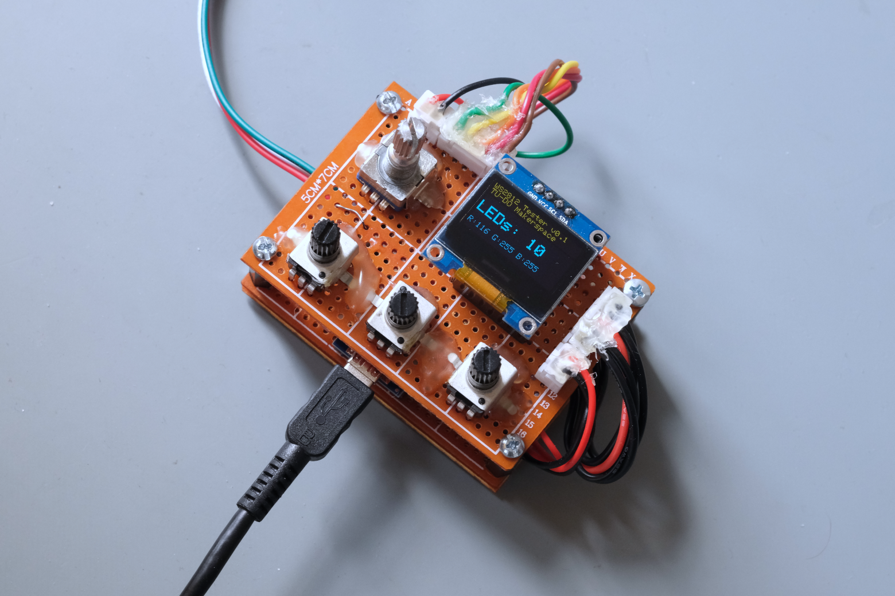

# WS2812 Strip Tester

This project is currently WIP, more info coming soon! :)

## Pins

### RGB Pots

|Arduino Pin|Potentiometer|
|-----------|-------------|
|A1 	    |Red  	  |
|A2 	    |Green	  |
|A3 	    |Blue         |

|Potentiometer|Arduino Pin|
|-------------|-----------|
|Red  	      |A1 	  |
|Green	      |A2 	  |
|Blue         |A3 	  |

### Rotary Encoder

|Rotary Pin|Arduino Pin|
|----------|-----------|
|A         |D3 	       |
|B         |D2 	       |

### I2C SSD1306 OLED Display

I2C address: `0x3C`

|I2C Pin|Arduino Pin|
|-------|-----------|
|SCL    |A5 	    |
|SDA    |A4 	    |
|VCC    |3.3v 	    |

### WS2812 RGB LEDs

Data pin: `UNKNOWN :(`